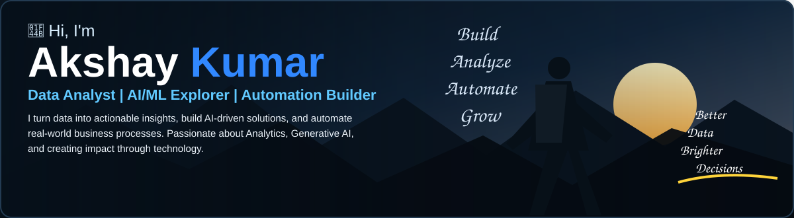

 &nbsp;
 &nbsp;
 &nbsp;
 &nbsp;

<table>
<tr>
<td align="center" width="25%"><h2>2+</h2><b>Years Experience</b> Analytics | ML | GenAI</td>
<td align="center" width="25%"><h2>500K+</h2><b>Records Analyzed</b> Across Multiple Projects</td>
<td align="center" width="25%"><h2>25%</h2><b>Improvement</b> Marketing Budget Accuracy</td>
<td align="center" width="25%"><h2>35%</h2><b>Workflow Efficiency</b> Through Automation</td>
</tr>
</table>

<table>
<tr>
<td width="72%" valign="top">

## 👤 About Me

I'm a Data Analyst with **2+ years of experience** working on data analytics, machine learning, Generative AI, Marketing Mix Modeling, and enterprise automation. I enjoy solving real business problems using data, building interactive dashboards, and developing AI-powered solutions that make processes smarter and faster.

</td>
<td width="28%" valign="top">

### 🎯 Currently Exploring

✅ Generative AI & RAG  
✅ LLM Applications  
✅ Data Engineering  
✅ AI Automation

</td>
</tr>
</table>

## 🛠️ Tech Stack

## 📁 Featured Projects

<table>
<tr>
<td width="33%" valign="top">

### 📊 Marketing Mix Modeling (MMM)

Built an end-to-end MMM solution using Python, OLS regression, adstock & saturation modeling to measure channel ROI and optimize marketing spend.

`Python` `Analytics` `MMM`

⭐ 8 &nbsp; 🔀 3  
**[View Project →](https://github.com/kumarakshay7)**

</td>
<td width="33%" valign="top">

### 🤖 Enterprise RAG AI Assistant

Built a RAG-based AI assistant using Azure OpenAI, LangChain, and Azure AI Search for enterprise document retrieval and intelligent Q&A.

`Python` `GenAI` `RAG`

⭐ 6 &nbsp; 🔀 2  
**[View Project →](https://github.com/kumarakshay7/Enterprise-RAG-AI-Assistant)**

</td>
<td width="33%" valign="top">

### ⚡ Power Platform Automation

Developed Power Apps, Power Automate flows and Copilot Studio solutions to streamline business workflows and improve efficiency.

`Power Apps` `Automation` `Power Platform`

⭐ 5 &nbsp; 🔀 1  
**[View Project →](https://github.com/kumarakshay7)**

</td>
</tr>
</table>

<table>
<tr>
<td width="68%" valign="top">

## 💼 Experience

### 🔵 Protics Research
**Data Analyst · Sep 2025 – Present**  
📍 New Delhi

- Analyzed booking journey data, dashboards for revenue, cancellations, and partner performance.
- Built data-driven insights to improve business operations.

### 🔵 Course 5 Intelligence Ltd
**Data Analyst / Analyst · Aug 2024 – Sep 2025**  
📍 Coimbatore, Tamil Nadu

- Built OLS regression models and MMM solutions for CPG clients, improving ROI measurement by 12%.
- Developed ML/AI solutions, dashboards, and Power Platform automation.

</td>
<td width="32%" valign="top">

## 🎓 Education

**MBA in Business Analytics**  
Lovely Professional University  
2022 – 2024

## 🏆 Certifications

✅ Microsoft Power Platform  
✅ Azure AI Fundamentals  
✅ Generative AI (Coursera)  
✅ Marketing Mix Modeling  
✅ SQL for Data Analysis  
✅ Python for Data Science

</td>
</tr>
</table>

## 📈 My GitHub Activity

<table>
<tr>
<td width="70%">

> *“Small steps in the right direction create big results.”*  
> **— Akshay Kumar**

</td>
<td width="30%" align="center">

**[View All Repositories →](https://github.com/kumarakshay7?tab=repositories)**

</td>
</tr>
</table>

### 🚀 Turning data into decisions. Building AI into useful products.

